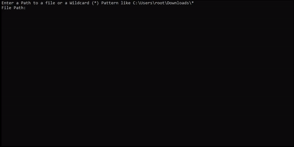

## File Merger ##
This is a project that merges arbitrary files into one single File.

## Usage ## 
- Start the binary.
- Type in all file paths you want to merge, or the directory with a wildcard (*)
- Press Enter
- Enter a destination filename.
- Profit

